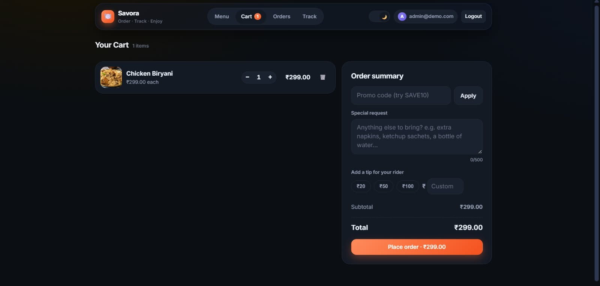
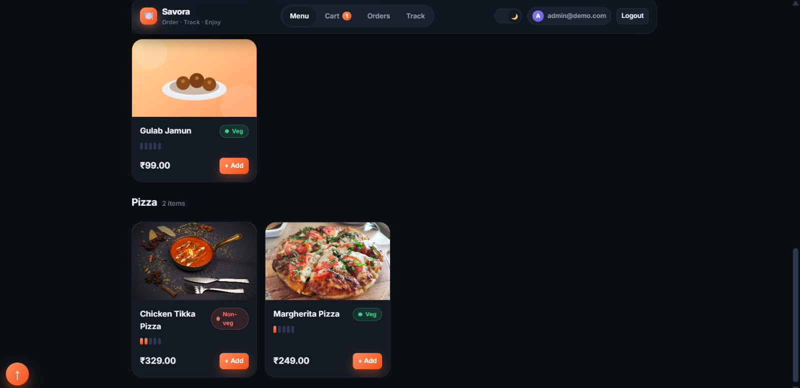
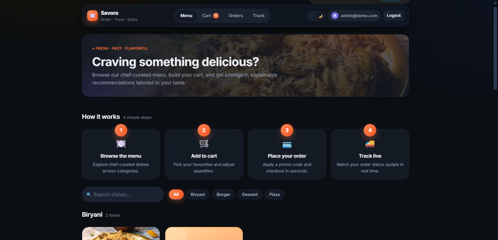
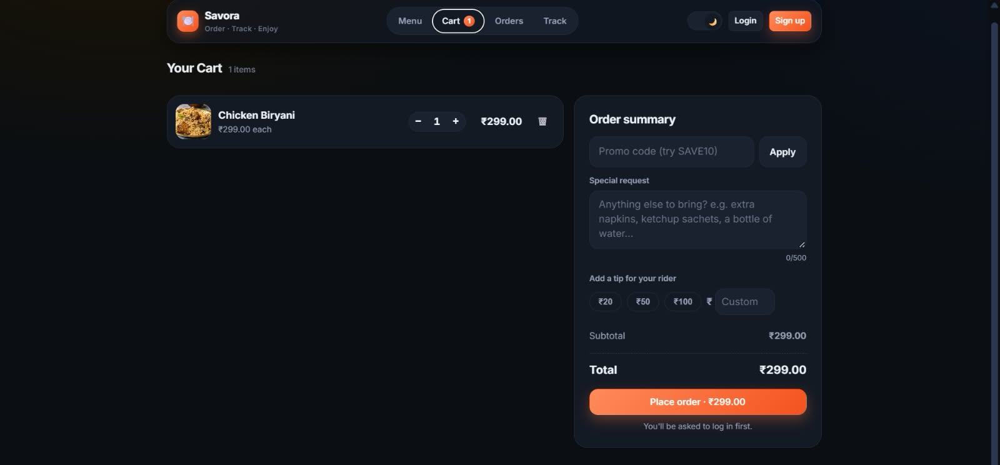
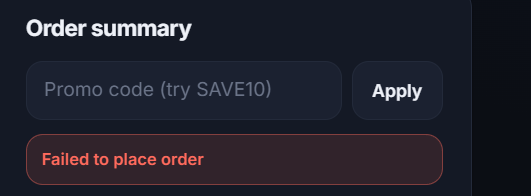
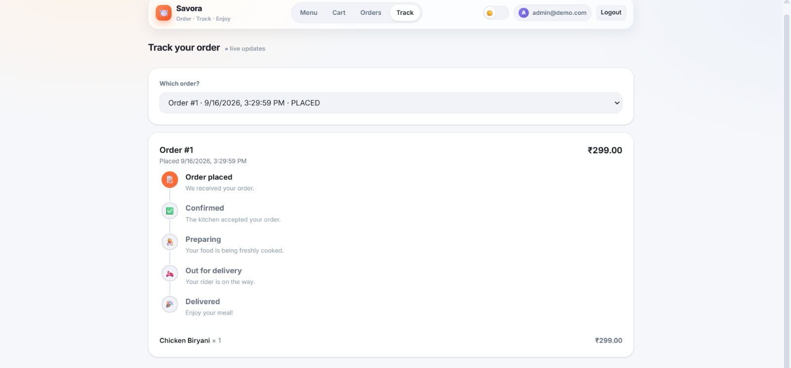
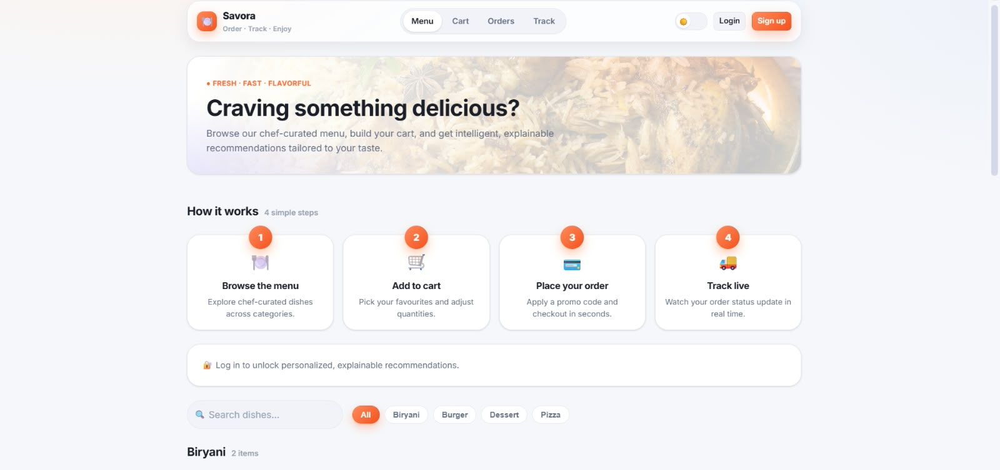
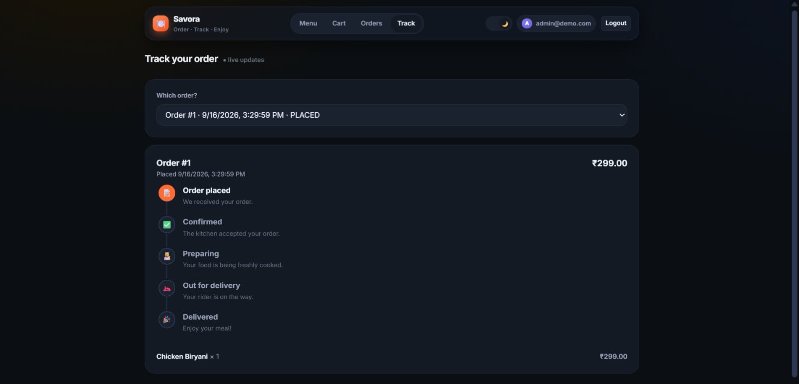

# 🍽️ Savora — Restaurant Ordering Platform

A full-stack restaurant ordering platform built with **Spring Boot and React**, featuring menu browsing, user authentication, order management, and personalized recommendations.

Savora provides a clean and simple ordering experience with a RESTful backend, JWT-based authentication, and a modern React frontend.

---

## 📸 Screenshots

### Application Showcase

<table>
  <tr>
    <td></td>
    <td></td>
  </tr>
  <tr>
    <td></td>
    <td></td>
  </tr>
  <tr>
    <td></td>
    <td></td>
  </tr>
  <tr>
    <td></td>
    <td></td>
  </tr>
</table>

---

## ✨ Features

- 🍔 Browse restaurant menu items
- 🛒 Place and manage food orders
- 🔐 User registration and JWT-based authentication
- 👨‍💼 Admin order management and status updates
- 💡 Personalized food recommendations
- 💾 Persistent file-based H2 database
- 🔄 RESTful API architecture
- 🖥️ Responsive React frontend
- 📊 Spring Boot Actuator for application monitoring

---

## 🛠️ Tech Stack

### Backend
- **Java 21**
- **Spring Boot**
- **Spring Security**
- **JWT Authentication**
- **Spring Data JPA**
- **H2 Database**
- **Maven**
- **Spring Boot Actuator**

### Frontend
- **React**
- **TypeScript**
- **Vite**
- **React Router**
- **Axios**

---

## 🏗️ Project Structure

```text
Restaurant 1/
├── backend/
│   ├── src/
│   ├── data/
│   ├── pom.xml
│   ├── dev-run.ps1
│   └── ...
├── frontend/
│   ├── src/
│   ├── package.json
│   └── ...
├── images/
│   ├── image_1.jpeg
│   ├── image_2.jpeg
│   ├── image_3.jpeg
│   ├── image_4.jpeg
│   ├── image_5.jpeg
│   ├── image_6.jpeg
│   ├── image_7.jpeg
│   └── image_8.jpeg
└── README.md
```

---

## 🚀 Getting Started

### Prerequisites

Make sure the following are installed:

- Java 21
- Node.js and npm
- Git

---

### 1. Clone the Repository

```bash
git clone <your-repository-url>
cd "Restaurant 1"
```

---

### 2. Run the Backend

Navigate to the backend directory:

```bash
cd backend
```

Run the application using the provided PowerShell script:

```powershell
.\dev-run.ps1
```

The script stops any existing backend process running on port `8080` and starts the Spring Boot application.

**Backend:**  
http://localhost:8080

**H2 Console:**  
http://localhost:8080/h2-console

> **Note:** Ensure Java 21 is installed and `JAVA_HOME` is configured correctly.

#### Demo Admin Credentials

```text
Email: admin@demo.com
Password: admin123
```

---

### 3. Run the Frontend

Open a new terminal and navigate to the frontend directory:

```bash
cd frontend
```

Install dependencies:

```bash
npm install
```

Start the development server:

```bash
npm run dev
```

**Frontend:**  
http://localhost:5173

---

## 🔌 API Endpoints

### Authentication

| Method | Endpoint | Description |
|--------|----------|-------------|
| POST | `/api/auth/register` | Register a new user |
| POST | `/api/auth/login` | Authenticate user and receive JWT |

### Menu

| Method | Endpoint | Description |
|--------|----------|-------------|
| GET | `/api/menu` | Retrieve available menu items |

### Orders

| Method | Endpoint | Description |
|--------|----------|-------------|
| POST | `/api/orders` | Create a new order |
| GET | `/api/orders` | Retrieve orders |
| GET | `/api/orders/{id}` | Retrieve an order by ID |
| PATCH | `/api/orders/{id}/status` | Update order status *(Admin)* |

### Recommendations

| Method | Endpoint | Description |
|--------|----------|-------------|
| GET | `/api/recommendations` | Retrieve food recommendations |

---

## 🔐 Authentication & Authorization

The application uses **Spring Security with JWT authentication**.

- Users can register and log in.
- Successful login returns a JWT.
- Protected endpoints require valid authentication.
- Admin-specific operations are restricted to authorized users.
- Order status updates are available to administrators.

---

## 💾 Database & Persistence

The backend uses a **file-based H2 database** with Spring Data JPA.

Application data is stored in:

```text
backend/data/
```

Because the database is file-based, data persists across application restarts.

> **Development Note:** The current configuration contains demo credentials/secrets in `application.properties`. These should be replaced with environment variables or a secure secrets manager before production deployment.

---

## 🧪 Development Notes

- Run only one backend instance at a time.
- The file-based H2 database is intended for local development and supports a single writer.
- Ensure the backend is running before accessing frontend features that depend on the API.

---

## 📌 Future Improvements

- Online payment integration
- Restaurant order tracking
- Email/order notifications
- Docker-based deployment
- Production database integration
- Cloud deployment
- Automated testing and CI/CD

---

## 👨‍💻 Author

**Karthik Reddy Anapana**

Built as a full-stack restaurant ordering project using **Spring Boot, React, and modern web technologies**.
